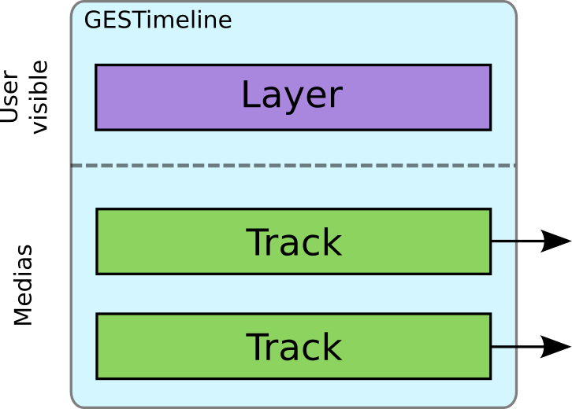

---
short-description:  GStreamer Editing Services API reference.
...

# GStreamer Editing Services

The "GStreamer Editing Services" is a library to simplify the creation
of multimedia editing applications. Based on the GStreamer multimedia framework
and the GNonLin set of plugins, its goals are to suit all types of editing-related
applications.

The GStreamer Editing Services are cross-platform and work on most UNIX-like
platform as well as Windows. It is released under the GNU Library General Public License
(GNU LGPL).

## Goals of GStreamer Editing Services

The GStreamer multimedia framework and the accompanying GNonLin set of
plugins for non-linear editing offer all the building blocks for:

-   Decoding and encoding to a wide variety of formats, through all the
    available GStreamer plugins.

-   Easily choosing segments of streams and arranging them through time
    through the GNonLin set of plugins.

But all those building blocks only offer stream-level access, which
results in developers who want to write non-linear editors to write a
consequent amount of code to get to the level of *non-linear editing*
notions which are closer and more meaningful for the end-user (and
therefore the application).

The GStreamer Editing Services (hereafter GES) aims to fill the gap
between GStreamer/GNonLin and the application developer by offering a
series of classes to simplify the creation of many kind of
editing-related applications.

## Architecture

### Timeline and TimelinePipeline

The most top-level object encapsulating every other object is the
[GESTimeline](GESTimeline). It is the central object for any editing project.

The `GESTimeline` is a `GstElement`. It can therefore be used in any
GStreamer pipeline like any other object.

### Tracks and Layers

The GESTimeline can contain two types of objects (seen in
"Layers and Tracks"):

-   Layers - Corresponds to the user-visible arrangement of clips, and
    what you primarily interact with as an application developer. A
    minimalistic timeline would only have one layer, but a more complex
    editing application could use as many as needed.

-   Tracks - Corresponds to the output streams in GStreamer. A typical
    GESTimeline, aimed at a video editing application, would have an
    audio track and a video track. A GESTimeline for an audio editing
    application would only require an audio track. Multiple layers can
    be related to each track.

In order to reduce even more the amount of GStreamer interaction the
application developer has to deal with, a convenience GstPipeline has
been made available specifically for Timelines : [GESPipeline](GESPipeline).
